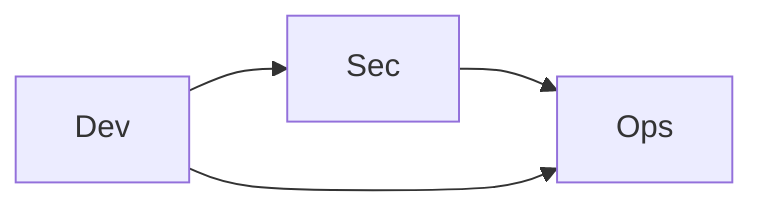
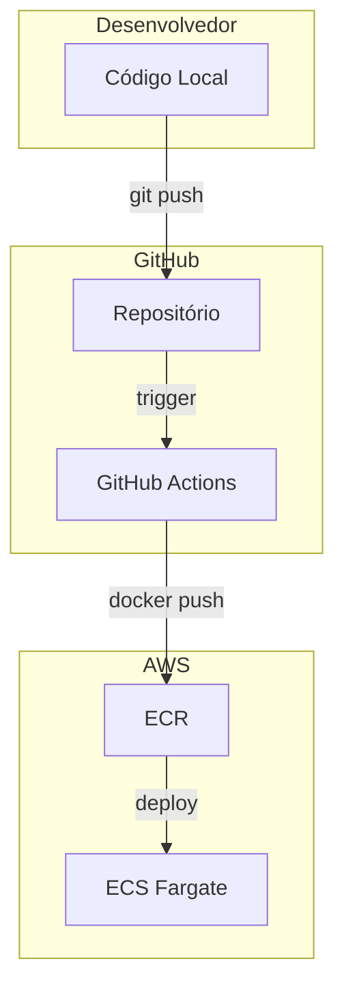

# 🎬 Vídeo 1.1 - Arquitetura de Referência e Setup do Laboratório

**Aula**: 1 - Pipeline CI/CD Seguro  
**Vídeo**: 1.1  
**Temas**: Arquitetura do laboratório; AWS Learner Lab; Configuração do ambiente; Deploy manual no ECS

---

## 🚀 Sobre Esta Aula

> **Aula inicial do curso!** Aqui você configura o ambiente AWS e faz o primeiro deploy.

### O que você vai fazer:

| Etapa | Descrição |
|-------|-----------|
| **AWS CLI** | Configurar profile `fiapaws` para Learner Lab |
| **ECR** | Criar repositório para imagens Docker |
| **ECS** | Criar cluster e service para rodar a app |
| **Pipeline** | Configurar GitHub Actions para CI/CD |

### Pré-requisitos

| Requisito | Como verificar |
|-----------|----------------|
| Docker instalado | `docker --version` |
| AWS CLI instalado | `aws --version` |
| Conta GitHub | Acesso ao github.com |
| AWS Learner Lab | Sessão ativa (🟢) |

### Primeira vez?
→ Faça fork do repositório `fiap-dclt-devsecops-aula01` e siga os passos abaixo ⬇️

---

## 📚 Parte 1: Conceitos Fundamentais

### Passo 1: O que é DevSecOps?

**DevSecOps** = Development + Security + Operations


```mermaid
graph LR
    A[Dev] --> B[Sec]
    B --> C[Ops]
    A --> C
```

**Diferença para DevOps tradicional:**
- DevOps: Dev → Ops (segurança no final)
- DevSecOps: Segurança integrada em TODAS as etapas

> **💡 Ponto-chave**: DevSecOps não é um cargo, é uma **cultura** de integrar segurança no ciclo de desenvolvimento.

---

### Passo 2: Arquitetura do Laboratório


```mermaid
graph TB
    subgraph "Desenvolvedor"
        A[Código Local]
    end
    
    subgraph "GitHub"
        B[Repositório]
        C[GitHub Actions]
    end
    
    subgraph "AWS"
        D[ECR]
        E[ECS Fargate]
    end
    
    A -->|git push| B
    B -->|trigger| C
    C -->|docker push| D
    D -->|deploy| E
```

**Componentes:**

| Componente | O que é | Para que serve |
|------------|---------|----------------|
| **ECR** | Elastic Container Registry | Armazena imagens Docker |
| **ECS** | Elastic Container Service | Executa containers |
| **Fargate** | Serverless compute | Roda containers sem gerenciar servidores |
| **GitHub Actions** | CI/CD nativo do GitHub | Automatiza build e deploy |

---

### Passo 3: Limitações do AWS Learner Lab

> ⚠️ **IMPORTANTE**: O ambiente Learner Lab tem restrições específicas!

| Recurso | Limitação | O que usar |
|---------|-----------|------------|
| **Regiões** | Apenas `us-east-1` e `us-west-2` | Sempre `us-east-1` |
| **IAM Roles** | Não pode criar | Usar `LabRole` |
| **Credenciais** | Temporárias (~4h) | Atualizar a cada sessão |
| **EC2** | Máx 9 instâncias | Tipos nano/micro/small |

**Credenciais AWS**:
- Começam com `ASIA` (não `AKIA`)
- Incluem `aws_session_token` obrigatório
- Expiram quando o lab para

---

## 🍴 Parte 2: Fork do Repositório

### Passo 4: Fazer Fork (NÃO clone!)

> **Por que Fork?** Você terá seu próprio repositório para configurar secrets e criar workflows.

**No GitHub:**

1. Acesse: `https://github.com/josenetoo/fiap-dclt-devsecops-aula01`
2. Clique no botão **Fork** (canto superior direito)
3. Selecione sua conta pessoal
4. Aguarde a cópia ser criada

**Resultado esperado:**
```
https://github.com/SEU-USUARIO/fiap-dclt-devsecops-aula01
```

---

### Passo 5: Clonar SEU Fork

**Linux/Mac:**
```bash
# Navegar para pasta de trabalho
cd ~/projetos

# Clonar SEU fork (substitua SEU-USUARIO)
git clone https://github.com/SEU-USUARIO/fiap-dclt-devsecops-aula01.git

# Entrar no diretório
cd fiap-dclt-devsecops-aula01

# Verificar estrutura
ls -la
```

**Windows (PowerShell):**
```powershell
# Navegar para pasta de trabalho
cd ~\projetos

# Clonar SEU fork (substitua SEU-USUARIO)
git clone https://github.com/SEU-USUARIO/fiap-dclt-devsecops-aula01.git

# Entrar no diretório
cd fiap-dclt-devsecops-aula01

# Verificar estrutura
Get-ChildItem
```

**Estrutura esperada:**
```
fiap-dclt-devsecops-aula01/
├── app.py              ← Aplicação Flask
├── requirements.txt    ← Dependências Python
├── Dockerfile          ← Build da imagem
├── Dockerfile.secure   ← Versão segura (aula 04)
├── .gitignore
├── .dockerignore
└── docs/
    ├── HANDSON-01-01.md
    ├── HANDSON-01-02.md
    └── HANDSON-01-03.md
```

---

## ☁️ Parte 3: Configurar AWS Learner Lab

### Passo 6: Iniciar o Lab

1. Acesse **AWS Academy Learner Lab**
2. Clique em **Start Lab**
3. Aguarde o indicador ficar **🟢 verde** (pode levar 2-3 minutos)
4. Clique no link **AWS** para abrir o console

**Validação**: ✅ Console AWS aberto

---

### Passo 7: Obter Credenciais AWS

1. No Learner Lab, clique em **AWS Details**
2. Clique em **Show** ao lado de "AWS CLI"
3. Copie o bloco de credenciais

**Exemplo do que você vai copiar:**
```ini
[default]
aws_access_key_id=ASIAXXX...
aws_secret_access_key=xxx...
aws_session_token=xxx...
```

---

### Passo 8: Configurar AWS CLI

**Linux/Mac:**
```bash
# Abrir arquivo de credenciais
nano ~/.aws/credentials

# Adicionar/substituir com profile fiapaws:
# [fiapaws]
# aws_access_key_id=ASIA...
# aws_secret_access_key=...
# aws_session_token=...

# Salvar: Ctrl+O, Enter, Ctrl+X

# Testar conexão
aws sts get-caller-identity --profile fiapaws
```

**Windows (PowerShell):**
```powershell
# Abrir arquivo de credenciais
notepad $HOME\.aws\credentials

# Adicionar/substituir com profile fiapaws:
# [fiapaws]
# aws_access_key_id=ASIA...
# aws_secret_access_key=...
# aws_session_token=...

# Salvar e fechar

# Testar conexão
aws sts get-caller-identity --profile fiapaws
```

**Resultado esperado:**
```json
{
    "UserId": "AROAXXXXXXXXX:user...",
    "Account": "123456789012",
    "Arn": "arn:aws:sts::123456789012:assumed-role/..."
}
```

---

## 🐳 Parte 4: Build e Push da Imagem

### Passo 9: Criar Repositório ECR

**Via Console:**
1. No console AWS, busque **ECR**
2. Clique em **Create repository**
3. Nome: `devsecops-app`
4. Clique em **Create**

**Via CLI (alternativa):**

**Linux/Mac:**
```bash
aws ecr create-repository \
  --repository-name devsecops-app \
  --region us-east-1 \
  --profile fiapaws
```

**Windows (PowerShell):**
```powershell
aws ecr create-repository `
  --repository-name devsecops-app `
  --region us-east-1 `
  --profile fiapaws
```

**Resultado esperado:**
```json
{
    "repository": {
        "repositoryName": "devsecops-app",
        "repositoryUri": "123456789012.dkr.ecr.us-east-1.amazonaws.com/devsecops-app"
    }
}
```

---

### Passo 10: Build da Imagem Docker

**Linux/Mac:**
```bash
cd ~/projetos/fiap-dclt-devsecops-aula01

# Definir variáveis
export AWS_PROFILE=fiapaws
export AWS_ACCOUNT_ID=$(aws sts get-caller-identity --query Account --output text)
echo "Account ID: $AWS_ACCOUNT_ID"

# Build da imagem (amd64 para compatibilidade com ECS)
docker build --platform linux/amd64 -t devsecops-app:latest .

# Verificar
docker images | grep devsecops-app
```

**Windows (PowerShell):**
```powershell
cd ~\projetos\fiap-dclt-devsecops-aula01

# Definir variáveis
$env:AWS_PROFILE="fiapaws"
$AWS_ACCOUNT_ID = aws sts get-caller-identity --query Account --output text
Write-Host "Account ID: $AWS_ACCOUNT_ID"

# Build da imagem (amd64 para compatibilidade com ECS)
docker build --platform linux/amd64 -t devsecops-app:latest .

# Verificar
docker images | Select-String "devsecops-app"
```

**Resultado esperado:**
```
devsecops-app   latest   abc123def456   10 seconds ago   150MB
```

---

### Passo 11: Testar Localmente

**Linux/Mac:**
```bash
# Executar container
docker run -d -p 8080:5000 --name teste-local devsecops-app:latest

# Testar
curl http://localhost:8080

# Parar e remover
docker stop teste-local && docker rm teste-local
```

**Windows (PowerShell):**
```powershell
# Executar container
docker run -d -p 8080:5000 --name teste-local devsecops-app:latest

# Testar (ou abra http://localhost:8080 no browser)
Invoke-WebRequest http://localhost:8080

# Parar e remover
docker stop teste-local; docker rm teste-local
```

**Resultado esperado:** Página HTML da aplicação

---

### Passo 12: Push para ECR

**Linux/Mac:**
```bash
# Login no ECR
aws ecr get-login-password --region us-east-1 --profile fiapaws | \
  docker login --username AWS --password-stdin \
  ${AWS_ACCOUNT_ID}.dkr.ecr.us-east-1.amazonaws.com

# Tag para ECR
docker tag devsecops-app:latest \
  ${AWS_ACCOUNT_ID}.dkr.ecr.us-east-1.amazonaws.com/devsecops-app:latest

# Push
docker push ${AWS_ACCOUNT_ID}.dkr.ecr.us-east-1.amazonaws.com/devsecops-app:latest
```

**Windows (PowerShell):**
```powershell
# Login no ECR
aws ecr get-login-password --region us-east-1 --profile fiapaws | `
  docker login --username AWS --password-stdin `
  "$AWS_ACCOUNT_ID.dkr.ecr.us-east-1.amazonaws.com"

# Tag para ECR
docker tag devsecops-app:latest `
  "$AWS_ACCOUNT_ID.dkr.ecr.us-east-1.amazonaws.com/devsecops-app:latest"

# Push
docker push "$AWS_ACCOUNT_ID.dkr.ecr.us-east-1.amazonaws.com/devsecops-app:latest"
```

**Resultado esperado:** `Login Succeeded` e upload completo

---

## 🚀 Parte 5: Deploy no ECS

### Passo 13: Criar Task Definition

**No Console ECS:**

1. Busque **ECS** > **Task definitions** > **Create**
2. Preencha:

| Campo | Valor |
|-------|-------|
| Family | `devsecops-task` |
| Launch type | AWS Fargate |
| OS | Linux/X86_64 |
| CPU | 0.25 vCPU |
| Memory | 0.5 GB |
| **Task role** | `LabRole` ⚠️ |
| **Execution role** | `LabRole` ⚠️ |

3. Em **Container**:

| Campo | Valor |
|-------|-------|
| Name | `devsecops-container` |
| Image URI | `<ACCOUNT>.dkr.ecr.us-east-1.amazonaws.com/devsecops-app:latest` |
| Port | `5000` |

4. Clique em **Create**

---

### Passo 14: Criar Cluster e Service

**Criar Cluster:**
1. ECS > **Clusters** > **Create cluster**
2. Nome: `devsecops-cluster`
3. Infrastructure: **Amazon EC2 instances** (ou "Fargate and EC2")
4. Em **Infrastructure**, selecione a role `LabRole`
5. Clique em **Create**

> ⚠️ **Learner Lab**: Não use "Fargate only" - o Lab não tem permissão para criar o Service-Linked Role necessário.

**Criar Service:**
1. Dentro do cluster > **Services** > **Create**

2. **Environment:**

| Campo | Valor |
|-------|-------|
| Launch type | FARGATE |
| Task definition | `devsecops-task` |
| Service name | `devsecops-service` |
| Desired tasks | 1 |

3. **Networking** (expanda esta seção):

| Campo | Valor |
|-------|-------|
| VPC | Selecione a VPC padrão |
| Subnets | Selecione pelo menos 1 subnet pública |
| Security group | Use existente ou crie um novo |
| **Public IP** | ✅ **ENABLED** (Turned on) ⚠️ |

> ⚠️ **Importante**: Sem Public IP habilitado, você não conseguirá acessar a aplicação!

4. Clique em **Create**

---

### Passo 15: Acessar Aplicação

1. No cluster > **Services** > clique em `devsecops-service`
2. Aba **Tasks** > clique na task
3. Copie o **Public IP**
4. Acesse: `http://<PUBLIC_IP>:5000`

**Resultado esperado:** 
```
✅ Aplicação carrega no browser!
```

---

## 🔧 Troubleshooting

| Erro | Causa | Solução |
|------|-------|---------|
| `ExpiredTokenException` | Credenciais expiradas | Atualizar `~/.aws/credentials` |
| Login ECR falha | Token expirado | Rodar `aws ecr get-login-password` novamente |
| Task não inicia | Imagem não encontrada | Verificar URI da imagem |
| Não acessa via browser | Security Group | Liberar porta 5000 |
| `Unable to assume service linked role` | Learner Lab sem permissão | Usar "EC2 instances" com `LabRole` |

---

## ✅ Checkpoint

Ao final deste vídeo você deve ter:

- [ ] Fork do repositório na sua conta
- [ ] AWS CLI configurado com profile `fiapaws`
- [ ] Imagem Docker buildada localmente
- [ ] Repositório ECR criado
- [ ] Imagem no ECR
- [ ] Cluster e Service ECS rodando
- [ ] Aplicação acessível no browser

---

**FIM DO VÍDEO 1.1** ✅
