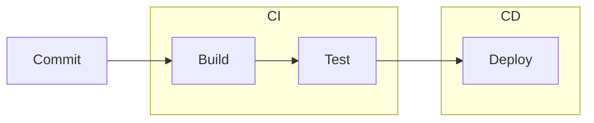
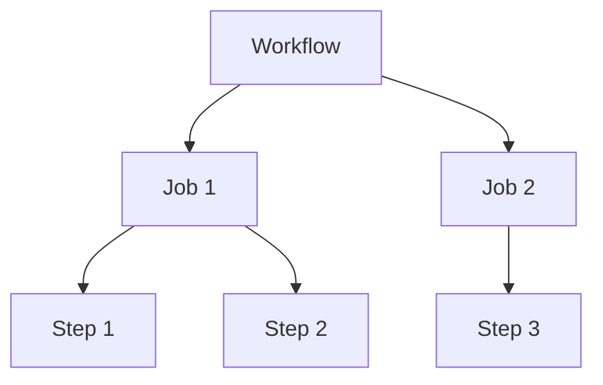
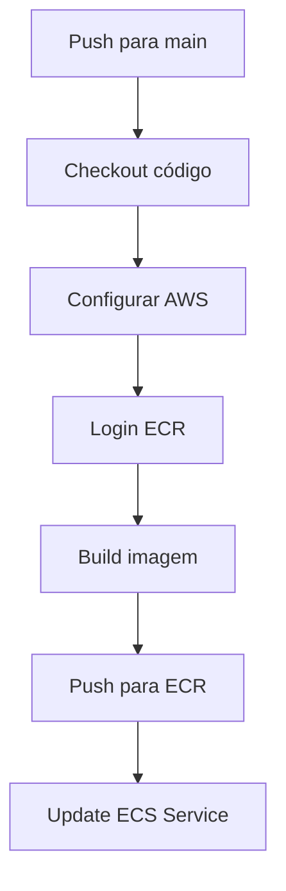

# 🎬 Vídeo 1.2 - Pipeline CI/CD com GitHub Actions

**Aula**: 1 - Pipeline CI/CD Seguro  
**Vídeo**: 1.2  
**Temas**: GitHub Actions; Workflows YAML; Secrets; Automatização do deploy

---

## 📚 Parte 1: Conceitos de CI/CD

### Passo 1: O que é CI/CD?

**CI** = Continuous Integration (Integração Contínua)
**CD** = Continuous Delivery/Deployment (Entrega/Deploy Contínuo)



| Termo | Significado | Exemplo |
|-------|-------------|---------|
| **CI** | Automatiza build e testes | A cada push, roda testes |
| **CD** | Automatiza deploy | Se testes passam, faz deploy |

---

### Passo 2: GitHub Actions - Conceitos

**Estrutura de um Workflow:**



| Componente | O que é | Exemplo |
|------------|---------|---------|
| **Workflow** | Arquivo YAML que define automação | `.github/workflows/deploy.yml` |
| **Trigger** | Evento que inicia o workflow | `on: push` |
| **Job** | Conjunto de steps que rodam juntos | `build`, `deploy` |
| **Step** | Ação individual | `docker build`, `docker push` |
| **Action** | Ação reutilizável da comunidade | `actions/checkout@v4` |

---

### Passo 3: Secrets no GitHub

> ⚠️ **NUNCA** coloque credenciais diretamente no código!

**O que são Secrets?**
- Variáveis criptografadas
- Não aparecem nos logs
- Acessadas via `${{ secrets.NOME }}`

**Secrets necessários para AWS Learner Lab:**

| Secret | Descrição | Obrigatório |
|--------|-----------|-------------|
| `AWS_ACCESS_KEY_ID` | Access Key | ✅ |
| `AWS_SECRET_ACCESS_KEY` | Secret Key | ✅ |
| `AWS_SESSION_TOKEN` | Session Token | ✅ (Learner Lab!) |

> 💡 No Learner Lab, o `AWS_SESSION_TOKEN` é **obrigatório** porque as credenciais são temporárias (STS).

---

## ⚙️ Parte 2: Configurar Secrets

### Passo 4: Obter Credenciais do Learner Lab

1. No AWS Academy, clique em **AWS Details**
2. Clique em **Show** ao lado de "AWS CLI"
3. Copie os três valores:
   - `aws_access_key_id`
   - `aws_secret_access_key`
   - `aws_session_token`

---

### Passo 5: Adicionar Secrets no GitHub

1. Acesse **SEU fork** no GitHub
2. Vá em **Settings** > **Secrets and variables** > **Actions**
3. Clique em **New repository secret**
4. Adicione cada secret:

| Name | Value |
|------|-------|
| `AWS_ACCESS_KEY_ID` | ASIA... |
| `AWS_SECRET_ACCESS_KEY` | (seu secret) |
| `AWS_SESSION_TOKEN` | (seu token) |

**Resultado esperado:**
```
✅ 3 repository secrets configurados
```

---

## 🔄 Parte 3: Criar Workflow

### Passo 6: Criar Arquivo de Workflow

**Linux/Mac:**
```bash
cd ~/projetos/fiap-dclt-devsecops-aula01

# Criar diretório de workflows
mkdir -p .github/workflows

# Criar arquivo de workflow
cat > .github/workflows/deploy.yml << 'EOF'
# ============================================
# WORKFLOW: Deploy para AWS ECS
# Automatiza build e deploy da aplicação
# ============================================
name: 🚀 Deploy to AWS

on:
  push:
    branches: [main]
  workflow_dispatch:  # Permite execução manual

env:
  AWS_REGION: us-east-1
  ECR_REPOSITORY: devsecops-app
  ECS_CLUSTER: devsecops-cluster
  ECS_SERVICE: devsecops-service
  CONTAINER_NAME: devsecops-container

jobs:
  # ============================================
  # JOB: Build e Deploy
  # ============================================
  deploy:
    name: 🏗️ Build and Deploy
    runs-on: ubuntu-latest

    steps:
      # Step 1: Checkout do código
      - name: 📥 Checkout
        uses: actions/checkout@v4

      # Step 2: Configurar credenciais AWS
      - name: 🔐 Configure AWS credentials
        uses: aws-actions/configure-aws-credentials@v4
        with:
          aws-access-key-id: ${{ secrets.AWS_ACCESS_KEY_ID }}
          aws-secret-access-key: ${{ secrets.AWS_SECRET_ACCESS_KEY }}
          aws-session-token: ${{ secrets.AWS_SESSION_TOKEN }}
          aws-region: ${{ env.AWS_REGION }}

      # Step 3: Login no ECR
      - name: 🔑 Login to Amazon ECR
        id: login-ecr
        uses: aws-actions/amazon-ecr-login@v2

      # Step 4: Build e Push da imagem
      - name: 🐳 Build and push Docker image
        id: build-image
        env:
          ECR_REGISTRY: ${{ steps.login-ecr.outputs.registry }}
          IMAGE_TAG: ${{ github.sha }}
        run: |
          docker build --platform linux/amd64 \
            -t $ECR_REGISTRY/$ECR_REPOSITORY:$IMAGE_TAG \
            -t $ECR_REGISTRY/$ECR_REPOSITORY:latest .
          docker push $ECR_REGISTRY/$ECR_REPOSITORY:$IMAGE_TAG
          docker push $ECR_REGISTRY/$ECR_REPOSITORY:latest
          echo "image=$ECR_REGISTRY/$ECR_REPOSITORY:$IMAGE_TAG" >> $GITHUB_OUTPUT

      # Step 5: Atualizar serviço ECS
      - name: 🚀 Deploy to ECS
        run: |
          aws ecs update-service \
            --cluster $ECS_CLUSTER \
            --service $ECS_SERVICE \
            --force-new-deployment
EOF
```

**Windows (PowerShell):**
```powershell
cd ~\projetos\fiap-dclt-devsecops-aula01

# Criar diretório de workflows
New-Item -ItemType Directory -Force -Path .github/workflows

# Criar arquivo de workflow
@'
# ============================================
# WORKFLOW: Deploy para AWS ECS
# Automatiza build e deploy da aplicação
# ============================================
name: 🚀 Deploy to AWS

on:
  push:
    branches: [main]
  workflow_dispatch:

env:
  AWS_REGION: us-east-1
  ECR_REPOSITORY: devsecops-app
  ECS_CLUSTER: devsecops-cluster
  ECS_SERVICE: devsecops-service
  CONTAINER_NAME: devsecops-container

jobs:
  deploy:
    name: 🏗️ Build and Deploy
    runs-on: ubuntu-latest

    steps:
      - name: 📥 Checkout
        uses: actions/checkout@v4

      - name: 🔐 Configure AWS credentials
        uses: aws-actions/configure-aws-credentials@v4
        with:
          aws-access-key-id: ${{ secrets.AWS_ACCESS_KEY_ID }}
          aws-secret-access-key: ${{ secrets.AWS_SECRET_ACCESS_KEY }}
          aws-session-token: ${{ secrets.AWS_SESSION_TOKEN }}
          aws-region: ${{ env.AWS_REGION }}

      - name: 🔑 Login to Amazon ECR
        id: login-ecr
        uses: aws-actions/amazon-ecr-login@v2

      - name: 🐳 Build and push Docker image
        id: build-image
        env:
          ECR_REGISTRY: ${{ steps.login-ecr.outputs.registry }}
          IMAGE_TAG: ${{ github.sha }}
        run: |
          docker build --platform linux/amd64 \
            -t $ECR_REGISTRY/$ECR_REPOSITORY:$IMAGE_TAG \
            -t $ECR_REGISTRY/$ECR_REPOSITORY:latest .
          docker push $ECR_REGISTRY/$ECR_REPOSITORY:$IMAGE_TAG
          docker push $ECR_REGISTRY/$ECR_REPOSITORY:latest
          echo "image=$ECR_REGISTRY/$ECR_REPOSITORY:$IMAGE_TAG" >> $GITHUB_OUTPUT

      - name: 🚀 Deploy to ECS
        run: |
          aws ecs update-service \
            --cluster $ECS_CLUSTER \
            --service $ECS_SERVICE \
            --force-new-deployment
'@ | Out-File -FilePath .github/workflows/deploy.yml -Encoding UTF8
```

---

### Passo 7: Entender o Workflow



**Explicação de cada step:**

| Step | O que faz |
|------|-----------|
| `Checkout` | Baixa o código do repositório |
| `Configure AWS` | Configura credenciais para acessar AWS |
| `Login ECR` | Autentica no registry de containers |
| `Build and push` | Cria imagem Docker e envia para ECR |
| `Deploy to ECS` | Força o ECS a usar a nova imagem |

---

## 🚀 Parte 4: Executar Pipeline

### Passo 8: Commit e Push

**Linux/Mac:**
```bash
cd ~/projetos/fiap-dclt-devsecops-aula01

# Verificar arquivo criado
cat .github/workflows/deploy.yml

# Adicionar ao git
git add .github/workflows/deploy.yml

# Commit
git commit -m "feat: adicionar pipeline CI/CD"

# Push
git push origin main
```

**Windows (PowerShell):**
```powershell
cd ~\projetos\fiap-dclt-devsecops-aula01

# Verificar arquivo criado
Get-Content .github/workflows/deploy.yml

# Adicionar ao git
git add .github/workflows/deploy.yml

# Commit
git commit -m "feat: adicionar pipeline CI/CD"

# Push
git push origin main
```

---

### Passo 9: Acompanhar Execução

1. No GitHub, vá para **Actions**
2. Clique no workflow **Deploy to AWS**
3. Clique na execução mais recente
4. Acompanhe os steps

**Resultado esperado:**

```
✅ Checkout
✅ Configure AWS credentials
✅ Login to Amazon ECR
✅ Build and push Docker image
✅ Deploy to ECS
```

---

### Passo 10: Verificar Deploy

1. Acesse o console AWS > ECS
2. Clique no cluster `devsecops-cluster`
3. Verifique que o service está **ACTIVE**
4. Acesse a aplicação pelo Public IP

**Resultado esperado:**
```
✅ Aplicação atualizada automaticamente!
```

---

## 🔧 Troubleshooting

| Erro | Causa | Solução |
|------|-------|---------|
| `Credentials not found` | Secrets não configurados | Verificar Settings > Secrets |
| `ExpiredTokenException` | Token expirado | Atualizar os 3 secrets |
| `AccessDenied` | Permissão insuficiente | Verificar se está usando `LabRole` |
| `Service not found` | ECS não existe | Criar cluster e service primeiro (Vídeo 1.1) |

---

## ✅ Checkpoint

Ao final deste vídeo você deve ter:

- [ ] 3 Secrets configurados no GitHub
- [ ] Arquivo `.github/workflows/deploy.yml` criado
- [ ] Pipeline executando com sucesso
- [ ] Deploy automático funcionando

---

**FIM DO VÍDEO 1.2** ✅
